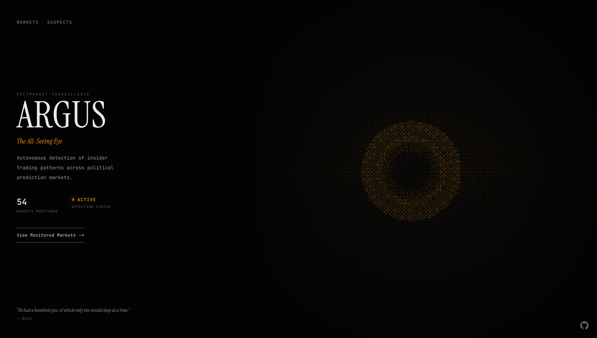
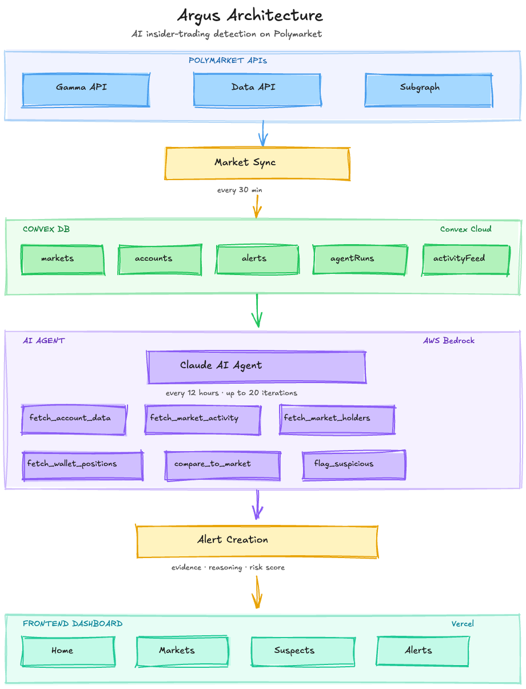
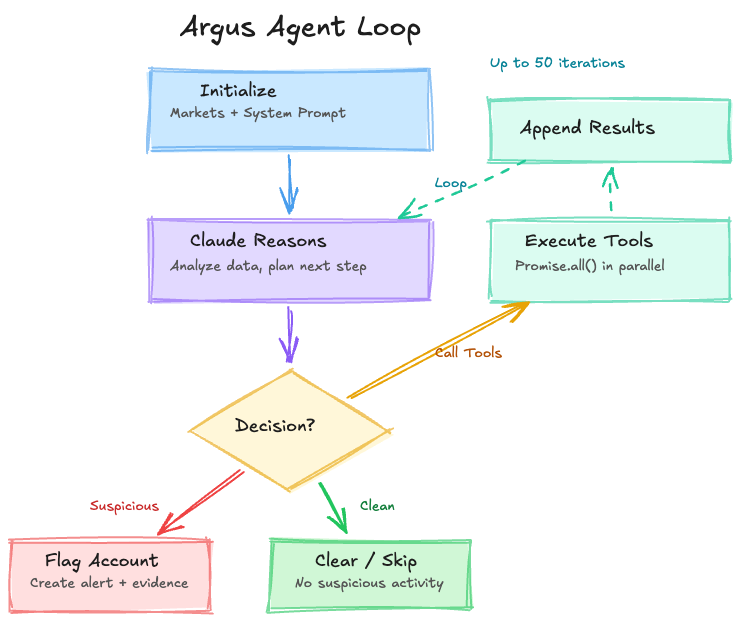
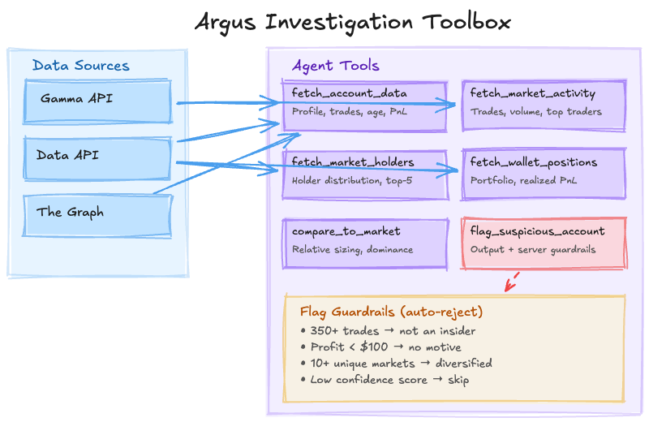
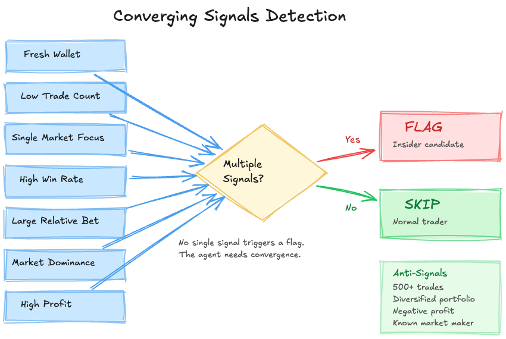

# Argus

[](LICENSE)
[](https://www.typescriptlang.org/)
[](https://nextjs.org/)
[](https://argusai.tech)

AI-powered market surveillance agent that monitors prediction markets for insider trading.

<p align="center">
  
</p>

## The Problem

Prediction markets move billions of dollars with zero surveillance infrastructure. No SEC. No detection systems. No accountability.

In January 2026, someone turned $32,000 into $436,000 on Polymarket by betting on Maduro's capture — one hour before the U.S. government announced it. The account was days old and had only ever bet on Venezuela. After winning, the username changed to a random string. Nobody caught it until the money was gone.

These patterns go undetected because no one is watching.

## How Argus Works

Argus is an autonomous AI agent — not a chatbot, not a dashboard with an AI button. It receives a set of markets and a toolbox of six investigation tools, then runs on its own: pulling account profiles, analyzing trading patterns, comparing every trade to its market context, and reasoning through evidence the way a financial crimes analyst would.

The system runs 24/7 via scheduled jobs with no human in the loop. Market data syncs regularly, and multiple times a day the agent wakes up, receives active markets, and runs its investigation autonomously.

No hardcoded rules. No if-else chains. The agent reads the data, thinks about what it means, and decides what to do next.

<p align="center">
  
</p>

## The Agent

### Agentic Loop

The agent runs on Claude via the AWS Bedrock Converse API in a fully autonomous loop:

1. **Initialize** — Receives market IDs and a system prompt teaching financial crimes investigation methodology, including real insider trading case studies with detailed signal breakdowns
2. **Iterate** (up to 50 turns) — Sends conversation history and tool definitions to Claude, extracts tool calls, executes them in parallel, appends results, repeats
3. **Terminate** — Returns findings, iteration count, tool call log, and token usage

Production optimizations keep this viable for 24/7 operation:
- **Sliding window context** — Only the last 7 messages stay in conversation, with a compressed summary of all findings prepended
- **Compressed tool responses** — Shortened field names cut ~60% of tokens per tool call
- **In-memory caching** — Market context (1hr TTL) and account profiles (24hr TTL) prevent redundant API calls
- **Early termination** — If the agent finds nothing suspicious after 3+ iterations, the loop breaks

<p align="center">
  
</p>

### Investigation Tools

The agent has six tools. Each wraps specific API calls and returns structured data for the agent to reason over:

| Tool | What It Does |
|------|-------------|
| `fetch_account_data` | Deep profile from 3 APIs: trade history, on-chain account age, name change detection, win rate, PnL breakdown, trades near resolution times |
| `fetch_market_activity` | Market-level context: trades, volume, unique traders, large trade count (>$5K), average trade size, top 10 traders |
| `fetch_market_holders` | Holder distribution, top-5 concentration ratio, largest holder percentage |
| `fetch_wallet_positions` | Full portfolio across all markets with realized/unrealized PnL and largest position |
| `compare_to_market` | Relative analysis: bet size vs. average, dominance %, volume percentile, whale/dominant/top-trader flags |
| `flag_suspicious_account` | Output tool with server-side guardrails: rejects flags on accounts with 350+ trades, profit <$100, 10+ unique markets, or low confidence scores |

<p align="center">
  
</p>

### Detection Signals

The agent evaluates traders across several signal dimensions — not as hardcoded rules, but as an investigation framework for reasoning through each case:

| Signal | What It Tells the Agent |
|--------|------------------------|
| **Wallet age** | Insiders create fresh accounts to avoid linking trades to their identity |
| **Trade count** | Insiders bet and disappear. Experienced traders have hundreds of trades across many markets |
| **Market concentration** | Normal traders diversify. Insiders go all-in on the one market where they have information |
| **Win rate vs. trade count** | 95% win rate over 5 trades is suspicious. 60% over 500 trades is a skilled trader |
| **Relative bet size** | A trade 10x the market average stands out. The agent compares every trade to its market context |
| **Market dominance** | Controlling 70% of a market is a very different signal than holding 0.1% |
| **Profit** | Insiders don't lose money. Low or negative profit is an instant disqualifier |

The critical insight: **relative metrics matter more than absolute ones.** A $5,000 bet means completely different things depending on the market. In a $10,000 market, that's 50% dominance. In a $10M market, it's a rounding error.

No single signal triggers a flag. The agent needs **multiple converging signals** on the same account before it acts.

<p align="center">
  
</p>

## Screenshots

<p align="center">
  
  <br />
  <em>Suspects page — flagged accounts with risk scores, win rates, and the signals that triggered investigation</em>
</p>

<p align="center">
  
  <br />
  <em>Expanded suspect card — full evidence breakdown with the agent's reasoning and supporting data</em>
</p>

## Tech Stack

| Layer | Technology |
|-------|-----------|
| **Frontend** | Next.js 15, React 19, Tailwind CSS |
| **Backend** | Convex (real-time database, cron jobs) |
| **AI** | Claude via AWS Bedrock (Converse API) |
| **Data** | Polymarket APIs, The Graph subgraph (on-chain) |
| **Language** | TypeScript |

## Getting Started

### Prerequisites

- [Bun](https://bun.sh/) (or Node.js 18+)
- [Convex](https://convex.dev/) account
- AWS account with [Bedrock](https://aws.amazon.com/bedrock/) access (Claude model enabled)

### Setup

```bash
git clone https://github.com/salimmohamed/argus.git
cd argus
bun install
```

Copy environment variables:

```bash
cp .env.example .env.local
```

Fill in your credentials in `.env.local`, then start the development servers:

```bash
npx convex dev   # Start Convex backend (terminal 1)
bun dev          # Start Next.js frontend (terminal 2)
```

## Roadmap

- [ ] Historical insider case backtesting for detection calibration
- [ ] Multi-platform support (Kalshi, PredictIt)
- [ ] Network analysis for coordinated trading rings
- [ ] Public API for researchers and journalists
- [ ] Automated evaluation pipeline for agent outputs

## Recognition

Winner of **Best Overall** at the [ColorStack](https://colorstack.org/) Winter Break Hackathon 2025 — 92 participants, 16 projects.

## Contributing

See [CONTRIBUTING.md](CONTRIBUTING.md) for development setup and guidelines.

## License

[MIT](LICENSE)

## Author

**Salim Mohamed** — [salimmohamed.dev](https://salimmohamed.dev) · [@salim_a_mohamed](https://twitter.com/salim_a_mohamed) · [LinkedIn](https://linkedin.com/in/salimmohamed)
